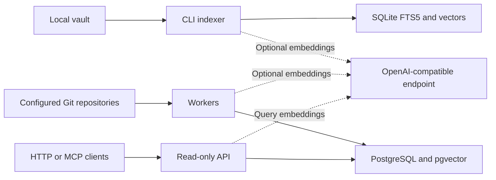

# Architecture

Obsidian Vault RAG retrieves source text and citations. It does not generate
answers, modify notes, run Obsidian, or require an Obsidian plugin.

## Local CLI

A vault-owned `.vault-rag.toml` selects files and declares egress policy. A
machine-local registry maps explicit profile names to vaults and an embedding
route. The index combines SQLite FTS5/BM25 lexical retrieval with optional dense
vectors. Reads validate source hashes and provide line citations. Changed files
are reconciled incrementally; a rebuild re-embeds the whole selected corpus.

## Shared service

Workers fetch only server-configured Git URLs and refs. PostgreSQL 18 with
pgvector stores indexed source text, vectors, synchronization state and immutable
revisions. Lease-coordinated workers build a new revision before promoting it;
API requests read consistent active revisions. Checkout volumes are disposable.
The API and worker can scale independently. Migrations run as a separate role.

The same retrieval facade supports HTTP and the stateless `/mcp` adapter.
[MCP tools](mcp.md) guide agents through profile selection, search, hash-verified
read and citation. No MCP tool mutates a vault or accepts arbitrary Git URLs.

## Trust and egress

There is no application authentication. Reachable clients are trusted to choose
any configured profile. Profiles bound retrieval, not caller identity. Use a
private trusted network and appropriate NetworkPolicies; do not expose the API
or MCP endpoint to the public Internet. Host/Origin checks mitigate DNS rebinding,
not unauthorized users. See [security policy](../SECURITY.md).

Remote embedding providers receive selected chunks and query text. A loopback
proxy can still forward data remotely: classify the ultimate data path honestly.
`local-only` plus a remote route disables semantic retrieval. Databases, indexes,
checkouts, backups, and client responses can contain the original sensitive notes.
They need the same access controls as the source vaults.

## Limitations

- No per-user ACLs, public SaaS boundary, generated answers, or filesystem watcher.
- Dense search quality depends on the selected model and corpus; benchmark numbers
  from another deployment are not performance guarantees.
- Git/provider outages can degrade freshness or semantics. Inspect status and
  degradation fields instead of assuming every result is current or semantic.
- CI covers synthetic contracts; private networking, credentials, database HA,
  backup recovery and real-corpus retrieval quality remain operator responsibilities.
